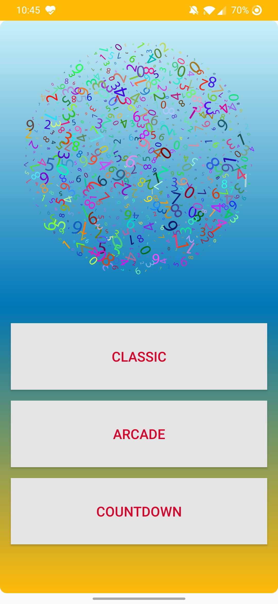
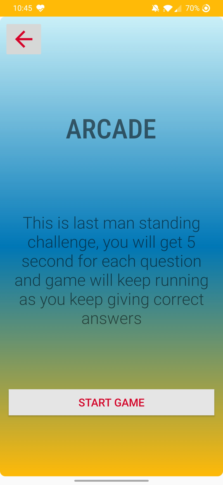
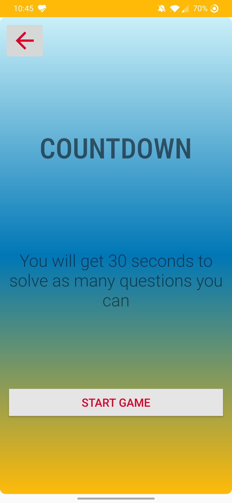
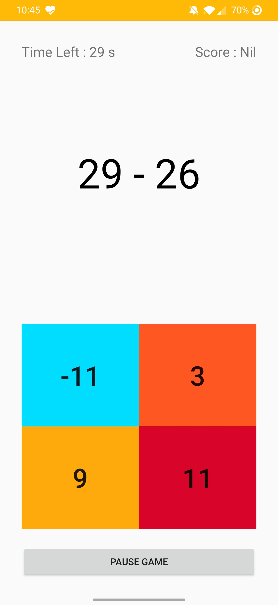
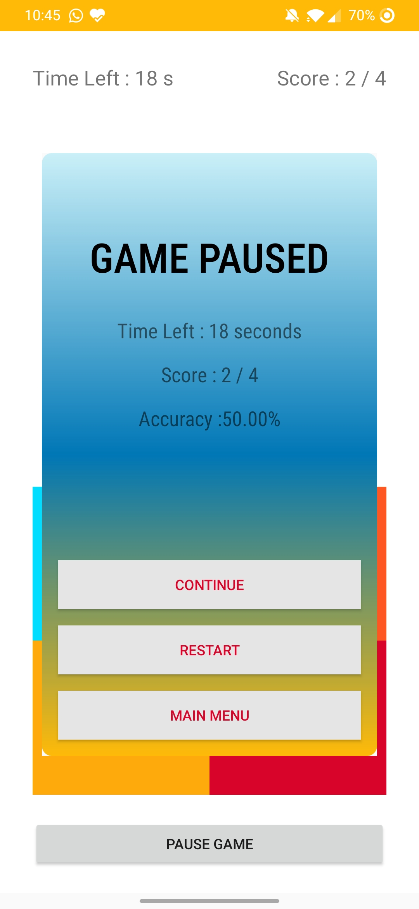
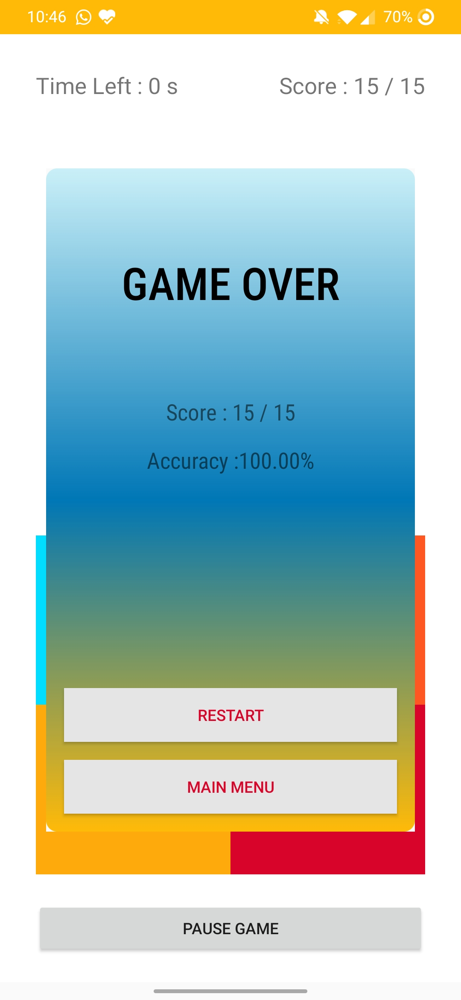

# DoTheMath

Download here - https://drive.google.com/file/d/1FmUK9s_KHk-ATh9CSRUkmB3RgvCmimn7/view?usp=sharing

Increase your brain power and compete against players from around the world!
Experience the heated battle that will keep you on your toes!

Develop your intellectual facilities by solving various mathematical tasks as quickly as possible. Limited amount of time for answering only stimulates your brain to work faster, better and more efficiently.
Mountain your Math skills by playing daily! 

# The main advantages:
- quick developing of memory and attention for children and adults
- efficient training of the brain
- simple and understandable process of playing
- game is available without Internet connection
- app doesn’t spend much time
- number sense

# The application will be useful for all ages:
For all ages: games for kids, for parents and for everybody!

- students and kids - to master the basics of mathematics and arithmetic, prepare for math tests and exams
- adults who want to keep their mind and brain in good shape

Brain Teasers do not require special knowledge so everyone can improve their brain function through repetition and adaptation.
Your main target is to reach the highest number possible within the time limit, all while dealing with the high difficulty and all the other challenges that appear as you play.

Boost up your IQ with the mobile app!
Math games is a brain-training, where logic & thinking & math meet fun, enjoyment, amusement and lighthearted pleasure. In our App we will see how to play together.

# Sceenshots : 

